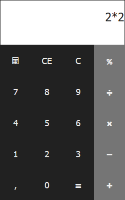

# JsCalc
### (c) 2017 Alfonso Saavedra "Son Link"

**JsCalc** es un calculadora programada en HTMl, CSS y Javascript como resultado de una practica de un curso al que asisto actualmente.
El código esta bajo la licencia GPL 3 o superior.

